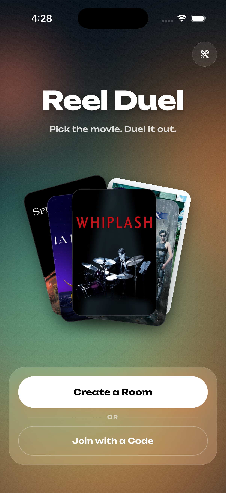
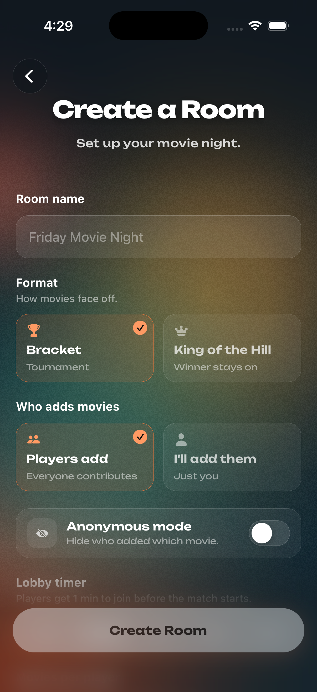
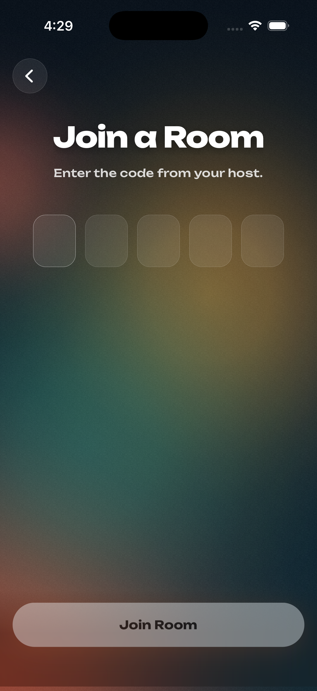
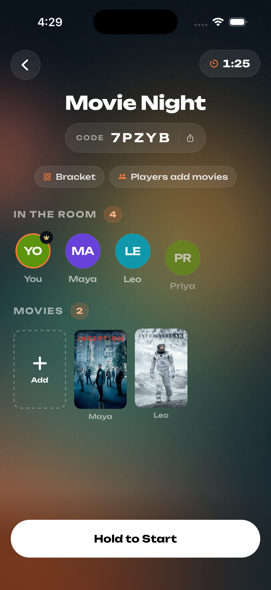
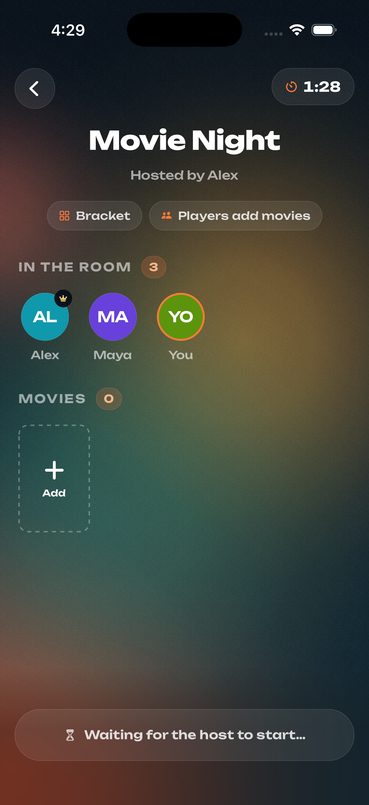
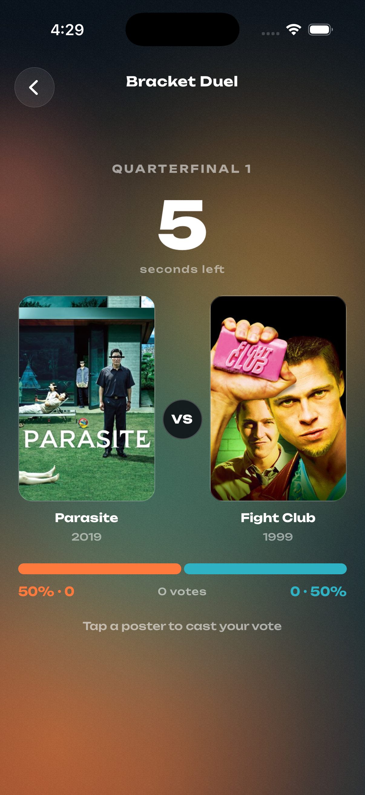
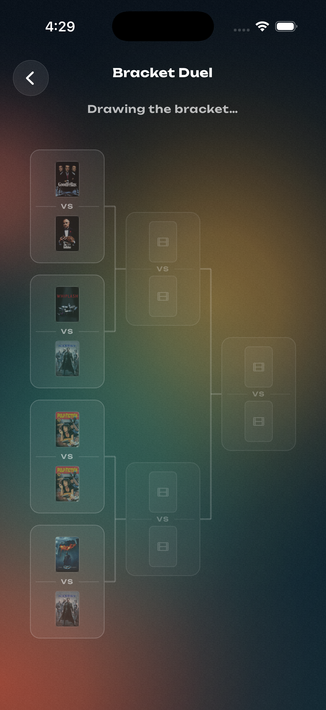
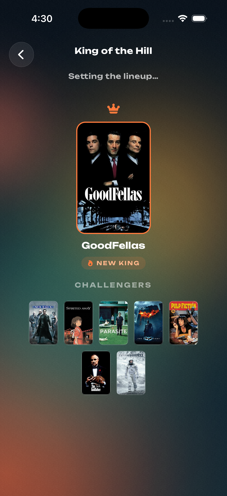

# ReelDuel 🎬

Settle the movie debate. Create a room, friends join with a code, movies face off head-to-head until one winner remains.

## How it works

1. One person creates a room and gets a 5-letter code
2. Friends join with the code and a nickname, no accounts
3. Everyone adds movies (or just the owner, your choice)
4. Movies battle in a bracket, everyone votes each matchup
5. One movie wins. That's what you watch.

## Modes

- **Bracket**: classic tournament, winners advance
- **King of the Hill**: winner stays, next challenger steps up

## Screenshots

| Main Menu | Create Room | Join with Code |
|:---:|:---:|:---:|
|  |  |  |

| Lobby (Host) | Lobby (Player) | Vote |
|:---:|:---:|:---:|
|  |  |  |

| Bracket | King of the Hill |
|:---:|:---:|
|  |  |

## Stack

- React Native + Expo (TypeScript)
- Firebase (Firestore, Anonymous Auth)
- TMDB API for movie data

## Status

🚧 In development
